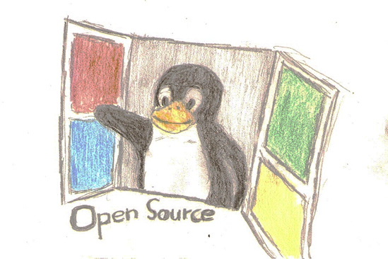

# HDTableViewMaker 中文文档



只需一行代码，快速配置`UITableView`的一切东西（最终目标），包括创建`Delegate`和`DataSource`、集成刷新等功能。

## 简介

`HDTableViewMaker`是一个轻量级的用于快速配置`UITableView`的框架。它提供了一些方便的API，帮助用户以一种快速和逻辑集中的方式配置出你想要的UITableView。


## 为什么使用
我们在开发App的时候，往往花费大量的时间在为`UITableView`写`DataSource`和`Delegate`上。而它们往往是一些重复性的并且难以维护的代码。因为它们分散在了各个代理方法中，当我们需要进行修改时，需要到各个代理方法中依次修改它们。

而`HDTableViewMaker`改变了这种书写方式，它提供一套简练的API，使得我们可以快速地书写有逻辑的，更集中的，更便于维护的代码。

为了让大家看到使用该框架的优势，我们来做一个对比：

使用原生方式创建`DataSource`和`Delegate`:

``` objective-c

// Native vision

// define a enum to split section

typedef NS_ENUM(NSInteger, SectionNameDefine) {
    SECTION_ONE,
    SECTION_TWO,
    SECTION_THREE,
    SECTION_FOUR,
    //...
    COUNT_OF_STORE_SECTION
};

// define identifier for section

#define IDENTIFIER_ONE  @"IDENTIFIER_ONE"
#define IDENTIFIER_TWO  @"IDENTIFIER_TWO"
#define IDENTIFIER_THREE  @"IDENTIFIER_THREE"
#define IDENTIFIER_FOUR @"IDENTIFIER_FOUR"
//...


// register cell class for section

[self.tableView registerClass:[OneCell class] forCellWithReuseIdentifier:IDENTIFIER_ONE];
[self.tableView registerClass:[TwoCell class] forCellWithReuseIdentifier:IDENTIFIER_TWO];
[self.tableView registerClass:[ThreeCell class] forCellWithReuseIdentifier:IDENTIFIER_THREE];
[self.tableView registerClass:[FourCell class] forCellWithReuseIdentifier:IDENTIFIER_FOUR];


// implementation datasource protocol

- (NSInteger)numberOfSectionsInTableView:(UITableView *)tableView {
    return COUNT_OF_STORE_SECTION;
}

- (NSInteger)tableView:(UITableView *)tableView numberOfRowsInSection:(NSInteger)section {
    return ((NSArray*)self.data[section]).count;
}

- (UITableViewCell *)tableView:(UITableView *)tableView cellForRowAtIndexPath:(NSIndexPath *)indexPath {
    NSUInteger section = (NSUInteger) indexPath.section;
    NSUInteger index = (NSUInteger) indexPath.row;
    switch(section) {
        case SECTION_ONE:
        // to do something
            return cell;
        case SECTION_TWO:
        // to do something
            return cell;
        case SECTION_THREE:
        // to do something
            return cell;
            
            //...
    }
    
    return cell;
}
// ...

```
可以看到，步骤多而繁琐，最让我受不了的是这种逻辑的分离，特别是在MVVM中严重影响了代码的內聚而且维护起来十分困难。
而使用`HDTableViewMaker`后

``` objective-c
    [[_mainTable hd_tableViewMaker:^(HDTableViewMaker *tableViewMaker) {
        
        tableViewMaker.hd_sectionCount(1).hd_sectionMaker(^(HDSectionMaker * sectionMaker){
            
            sectionMaker.hd_dataArr(^(){
                return self.dataArr;
            }).hd_cellMaker(^(HDCellMaker *cellMaker){
                
                cellMaker.hd_cellClass([HDTableViewCell class]).hd_adapter(^(HDTableViewCell *cell,id data,NSIndexPath *indexPath){
                    cell.title = data;
                }).hd_autoHeight();
                
            });
        });
    }] hd_addAllFresh:^(HDFreshType freshType) {
        
    }];
```
可以看到代码变得简练而富有层次感了，更加符合人类的思维方式。而且这些配置都支持无序配置的，不管你先设置什么后设置什么，最后的效果都是一样的，所以想怎么设置就怎么设置吧。

## 关于框架后续以及框架性能
写这个框架的初衷是想把UITableView这个在IOS开发中用的最多也是最难搞的东西给简化起来、通过三言两语的配置就能展示出自己想要的效果，并且整合一些在UITableView上面的一些常用的功能，接下来会打算实现全屏的loading以及emptyset。
框架实现是封装存储了配置时候设置的属性、等到一定的时机读取这些配置而已、所以性能上只能多存储了一些变量罢了。

## 用法

### 安装

使用`cocoapods`下载

``` ruby
pod 'HDTableViewMaker'
```

### 导入包

``` objective-c
#import <HDTableViewMaker/HDTableViewMakerHeader.h>
```

### 创建`DataSource`和`Delegate`并添加刷新控件

``` objective-c
       [[_mainTable hd_tableViewMaker:^(HDTableViewMaker *tableViewMaker) {
        
        tableViewMaker.hd_sectionCount(1).hd_sectionMaker(^(HDSectionMaker * sectionMaker){
            
            sectionMaker.hd_dataArr(^(){
                return self.dataArr;
            }).hd_cellMaker(^(HDCellMaker *cellMaker){
                
                cellMaker.hd_cellClass([HDTableViewCell class]).hd_adapter(^(HDTableViewCell *cell,id data,NSIndexPath *indexPath){
                    cell.title = data;
                }).hd_autoHeight();
                
            });
        });
    }] hd_addAllFresh:^(HDFreshType freshType) {
        
    }];
```

#### HDTableViewMaker支持设置以下属性：
**注意这些属性都是针对整个UITableView**

##### hd_sectionCount
用户配置这个tableView中存在几个的section
``` objective-c
  dataSourceMaker.hd_sectionCount(10)
```

##### hd_sectionMaker
用于为UITableView配置每一个section。用法如下：

``` objective-c
    [_mainTable hd_tableViewMaker:^(HDTableViewMaker *tableViewMaker) {
        
        tableViewMaker
        .hd_sectionMaker(^(HDSectionMaker * sectionMaker){
            //...
        });
    }];
    
```

##### hd_height
为整个UITableView的Cell设置默认高度。用法如下：

``` objective-c
tableViewMaker.hd_height(100);
```

该属性与HDSectionMaker和HDCellMaker设置的hd_height和hd_autoHeight冲突。优先级是autoHeight(cell) >height(cell) > height(section) > height(UITableView)

也就是说，当一个cell设置了autoHeight，则以autoHeight为准，其他cell未设置autoHeight，而设置了height（cell），则以height（cell）为准，如果两者都没有，则以height（section）为准。类推。height默认为40。

##### hd_headerView
设置UITableView的tableHeaderView，注意与section的headerView的区别，一个UITableView只有一个tableHeaderView。用法如下：

``` objective-c
make.hd_headerView(^(){
    UIView * headerView = [[UIView alloc]init];
    // ...
    return headerView;
});
```

##### footerView
设置UITableView的tableFooterView，同上。

##### hd_commitEditing
设置UITableView的commitEditing代理方法，设置了该方法，则cell侧滑可以出现删除按钮。
可以在刚方法设置当cell处于编辑状态需要处理的事件。用法如下：

``` objective-c
 [make commitEditing:^(UITableView * tableView, UITableViewCellEditingStyle * editingStyle, NSIndexPath * indexPath) {
    // do somethings.                
}];
```

##### hd_scrollViewDidScroll
设置UITableView的scrollViewDidScroll代理方法，当UITableView滚动时会调用该方法。
可以使用该方法处理UITableView的滚动事件。

````objective-c
[make scrollViewDidScroll:^(UIScrollView * scrollView) {
    // do somethings                
}];
````

## HDSectionMaker对象支持设置以下属性：

**注意，这些设置都是针对单独的section设置的**

##### hd_dataArr 

设置这个section中所要展示的数据。参数是一个返回NSArray。
这样在外界的dataArr发生变化以后调用reload就可能刷新整个UITableView了。
如下：

``` objective-c
sectionMaker.hd_dataArr(^(){
                return self.dataArr;
            }).
```

##### hd_headerTitle;

设置section的headerTitle。用法如：

``` objective-c
section.hd_headerTitle("title");
```

##### hd_footerTitle;

设置section的footerTitle。用法同上。

##### hd_headerView;

设置section的Header View。用法如下：

``` objective-c
section.hd_headerView(^(){
    UIView * headerView = [UIView alloc]initWithFrame:CGRectMake(0,0,320,40);
    // ...
    return headerView;
})
```
该属性与headerTitle冲突，当设置了headerView，以headerView为准。

##### hd_footerView;

设置section的Footer View。用法同上
该属性与footerTitle冲突，当设置了footerView，以footerView为准。


## HDCellMaker对象支持设置以下属性：

**注意，这些设置都是针对单独的cell设置的**

##### hd_cellClass

设置`UITableView`展示数据用的Cell Class。该Class会自动注册identifier(XIB)，无需手动注册

如：

``` objective-c
make.hd_cellClass([CustomCell class]);
```

##### hd_adapter

用于适配`Cell`和`Data`，做过安卓的应该很熟悉这个词。如:

``` objection-c
cell.hd_adapter(^(CustomCell * cell,id data,NSIndexPath *indexPath) {
    [cell configure:data];
    // ...
});
```

##### hd_event

设置点击cell的响应事件。如：

``` objective-c
make.hd_event(^(NSIndexPath *indexPath,id data) {
    CustomViewController * controller = [CustomViewController new];
    controller.viewModel.data = data;
    [self.navigationController pushViewController:controller animated:YES];
});
```

##### hd_height

用于设置cell的高度。传一个固定的值。该高度只对该cell有效。如：

``` objective-c
make.hd_height(100);
```

##### hd_autoHeight

设置自动动态计算cell高度。用于cell高度不一的场景。

``` objective-c
make.hd_autoHeight();
```
该属性与height冲突，优先级是autoHeight > height。
也就是说当设置了autoHeight，则height失效，高度以autoHeight为准


## 关于上拉下拉刷新的配置
#####hd_addFreshHeader
添加头部刷新
#####hd_addFreshFooter
添加上拉加载更多
#####hd_addAllFresh
全部添加
#####hd_endFreshing
结束刷新、注意的是参数existMoreData，如果是YES，则可以上拉加载更多，如果是NO则上拉加载更多会自动变成已经加载全部数据。在数据源为空时会自动隐藏加载更多控件


## 鸣谢

感谢您的使用和支持。欢迎issue和pull request，我会在第一时间内处理。

在这个框架中，我参考了许多大神们设计的框架。比如API的设计就参考了著名的AutoLayout框架Masonry。而在动态计算cell的高度上，则使用了@forkingdog的UITableView-FDTemplateLayoutCell大法。刷新控件使用了大家都在用的MJRefresh。

感谢他们带给我的灵感。

如有任何问题需要第一时间得到回答，请加QQ：9395220。

